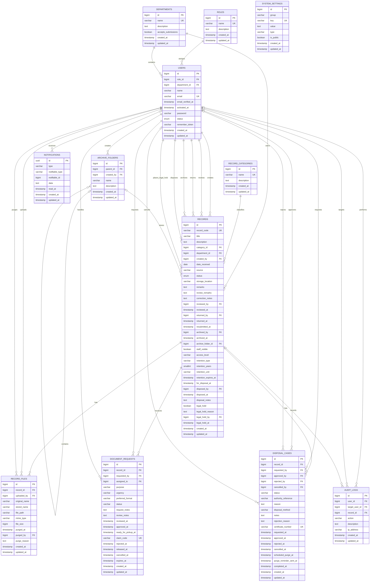
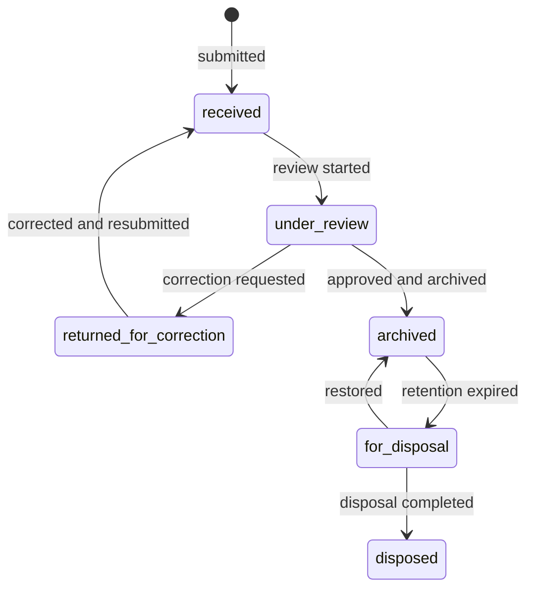
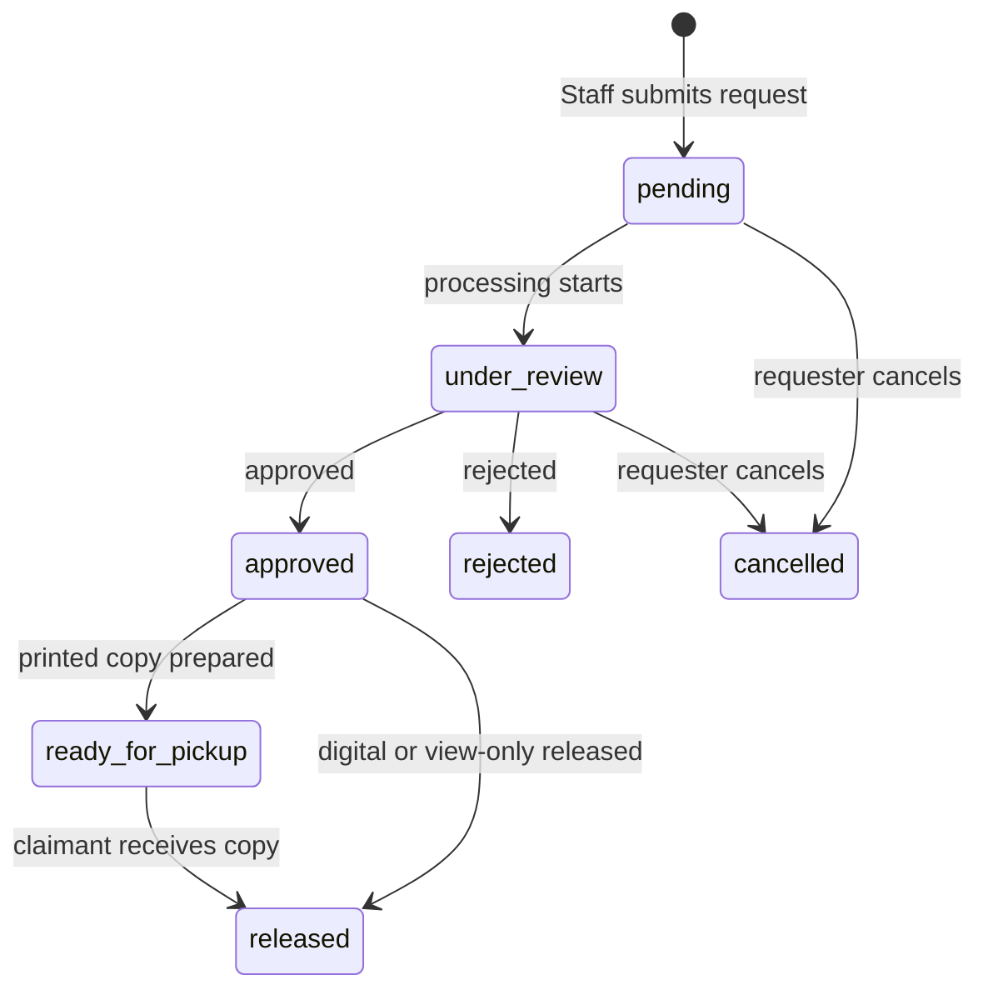

# IRAM Entity Relationship Diagram

This ERD reflects the current Laravel migrations and Eloquent relationships.
It focuses on IRAM domain data. Laravel infrastructure tables are listed
separately below.



## Relationship notes

- A User belongs to one Role and may belong to one Department.
- A Record belongs to one category, department, and creator.
- Review, correction, archive, disposal, and legal-hold user references on a
  Record are nullable so history survives account deletion.
- An Archive Folder may contain child folders and records.
- Record Files store metadata in MySQL. The actual uploaded document is stored
  under `backend/storage/app/private/records`.
- A Document Request belongs to one Record and requester. Its assignee is
  optional until a manager starts processing it.
- A Disposal Case belongs to one Record. Workflow actor references are
  optional and use `nullOnDelete`.
- Audit Logs may reference the acting user, affected user, and related Record.
- Notifications use Laravel's polymorphic `notifiable_type` and
  `notifiable_id` columns. In IRAM they currently target Users, but the
  database does not enforce a direct foreign key.
- System Settings are independent key/value configuration records.

## Record lifecycle



## Document request lifecycle



## Laravel infrastructure tables

These support the application but are omitted from the main ERD to keep the
domain model readable:

| Table | Purpose |
| --- | --- |
| `personal_access_tokens` | Sanctum API authentication |
| `sessions` | Database-backed browser sessions |
| `password_reset_tokens` | Password reset tokens |
| `cache`, `cache_locks` | Laravel cache and locks |
| `jobs`, `job_batches`, `failed_jobs` | Database queue processing |
| `migrations` | Applied migration history |

## Source of truth

The executable schema remains the migration set in:

```text
backend/database/migrations
```

Update this ERD whenever a migration adds, removes, or changes a domain table
or foreign key.
